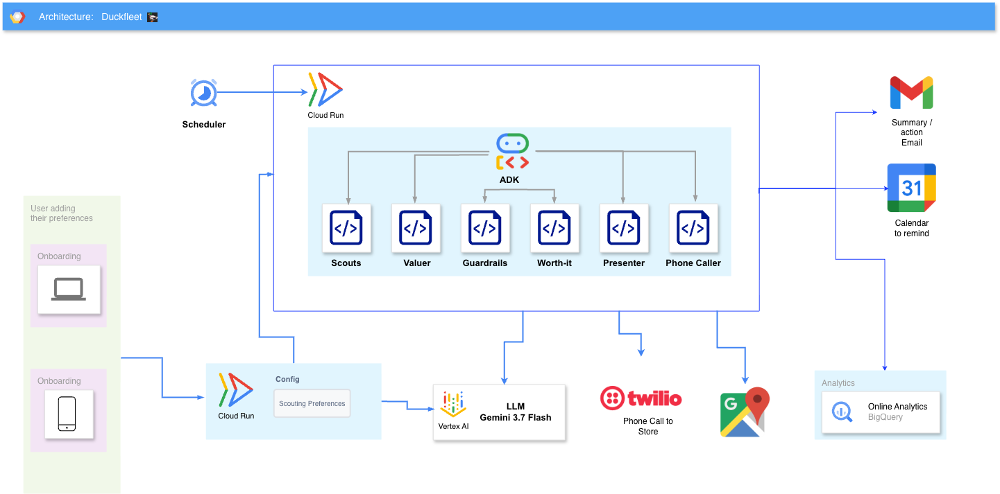

# DuckFleet 🦆✈️

**A background agent fleet that turns rubber ducks into business-class seats.**

In 2025, a $3.50 BigW rubber duck — stacked across promotions — earned Qantas Points at
0.59c/point. The only people who caught it were forum addicts refreshing OzBargain.
DuckFleet is a fleet of agents that hunts the next duck while you sleep: it ingests offers
overnight, does the stacking maths, respects what you actually want, works out whether an
errand is worth your time and petrol, can phone the store to verify stock (with your
approval), and emails you a ranked morning brief — then reports whether the run was even
worth its own compute.

**Track:** The Taskmaster — background agents that handle the heavy lifting asynchronously.

## Try it in ~5 minutes

Deploy the fleet to your own Google Cloud project in **replay mode** (a deterministic demo
brief, no secrets needed) and watch it produce a morning brief — a guided Cloud Shell
walkthrough does the rest:

[](https://shell.cloud.google.com/cloudshell/editor?cloudshell_git_repo=https://github.com/avipaul6/fleet&cloudshell_tutorial=runtimes/gcp_adk/tutorial.md)

It runs on **your** Google Cloud, so you pay for your own usage — the Cloud Run Job scales
to zero when idle and a nightly run costs cents. Add Gmail delivery, Twilio calls, or a
nightly schedule afterwards — see [`runtimes/gcp_adk/README.md`](runtimes/gcp_adk/README.md).

---

## Architecture



<sub>Nightly &amp; governed on Google Cloud: Cloud Scheduler → a Cloud Run Job runs the ADK fleet (scouts → valuer → guardrails → worth-it → presenter → gated caller) on Vertex AI, using Maps Routes, Text-to-Speech, BigQuery, Cloud Logging and Secret Manager, delivering via Gmail, Twilio and Calendar.</sub>

Google Cloud throughout (telephony via Twilio): **Cloud Scheduler** fires a nightly
**Cloud Run Job** that runs the ADK fleet — scouts → valuer → guardrails → worth-it →
presenter → gated caller — using **Vertex AI** (Gemini flash + pro), **Maps Routes**,
**Text-to-Speech** and **Secret Manager**, then writes to **BigQuery** + **Cloud Logging**
and delivers via the **Gmail API**, **Twilio**, and Google Calendar links.

**Agent fleet (Google ADK, Python):**

| Agent | Job | Tier |
|---|---|---|
| `fleet` (orchestrator) | Sequences the pipeline; owns guardrails, economics, delivery | — |
| `scout_ozbargain` | Ingests the OzBargain feed → normalised `Offer` (with category) | flash |
| `valuer` | Stack detection + cents-per-point (deterministic maths) | pro |
| `worth_it` | Drive time + fuel vs value — can **refuse** | flash |
| `caller` | Gated voice stock-verification (Text-to-Speech + Twilio) | pro |
| `presenter` | Ranked morning brief | flash |
| `onboarding` | Chat that writes your `profile.json` (programs, preferences) | flash |

**Governance is a feature, not a slide.** Every real-world action passes through
`guardrails/gates.py` — spend cap, ToS filter, **your category preferences**,
one-call-per-store, AI self-identification, human approval, and a structured audit trail.
The fleet *refuses* errands that aren't worth the drive, *skips* what you don't want (and
says why), *asks permission* before dialling, and even *governs its own cost* (reports the
run's ROI). 18 red-team eval tests keep it honest — `python -m evals.run`.

---

## Model tiers (flash + pro)

Every agent takes its model from config, resolved by `agents/model_factory.py`, across two
tiers — **flash** (fast: scouts, worth-it, presenter) and **pro** (strong: valuer, caller):

- Plain model id (e.g. `gemini-3.5-flash`) → native Gemini via ADK on Vertex AI.
- `vertex_ai/...` prefix → wrapped in ADK's `LiteLlm`, still on **Vertex AI Model Garden** —
  so you can A/B Gemini vs Claude *without leaving GCP*, per tier, via env vars:

```bash
export DUCKFLEET_MODEL_FAST="gemini-3.5-flash"    # flash tier
export DUCKFLEET_MODEL_STRONG="gemini-3.5-flash"  # pro tier (swap to a 3.x Pro when available)
# A/B the pro tier against Claude on Vertex:
export DUCKFLEET_MODEL_STRONG="vertex_ai/claude-sonnet-4-5"
```

Both tiers default to **Gemini 3.5 Flash** (the hackathon requires Gemini 3+). Rationale
and model-choice notes live in [`devlog/`](devlog/).

---

## Quickstart (local)

```bash
python3.12 -m venv .venv && source .venv/bin/activate
pip install -r requirements.txt
cp .env.example .env          # set your GCP project, home location, caps, delivery
python scripts/dev_fleet.py   # run the whole fleet on fixtures → a morning brief
python -m evals.run           # red-team the guardrails
adk web adk_apps              # chat with each agent (incl. onboarding) in the dev UI
```

Deploy to Google Cloud: see [`runtimes/gcp_adk/README.md`](runtimes/gcp_adk/README.md)
(Cloud Run Job + Cloud Scheduler; scales to zero when idle).

## 🧪 Reproducible testing

Everything here is **deterministic** — same input, same output — so anyone can reproduce
DuckFleet's results without touching our data or credentials.

```bash
python3.12 -m venv .venv && source .venv/bin/activate
pip install -r requirements.txt

# 1. Red-team the guardrails — 18 failure-mode tests. FULLY LOCAL: no Google Cloud, no keys.
python -m evals.run
#    Exercises the spend / ToS / preference / call gates and the deterministic
#    valuation + worth-it maths directly. Expect: all 18 pass.

# 2. Deterministic replay → a known-good morning brief from frozen fixtures.
python scripts/dev_fleet.py

# 3. Reproduce the governance "refusals" beat — an over-distance pickup and a
#    "no new credit cards" offer, each skipped with an honest reason.
DUCKFLEET_REPLAY_FIXTURE=demo_skips.json python scripts/dev_fleet.py
```

**What needs what:**
- **Step 1 needs no cloud** — it's the fastest way to verify the governance behaviour and is
  the suite that runs in CI. All maths is deterministic Python (the LLM never does arithmetic).
- **Steps 2–3** run the full fleet on **frozen fixtures** (drive times captured once from the
  Maps Routes API, then frozen), so the brief is stable across runs. The presenter step calls
  Vertex AI, so set up ADC first — `gcloud auth application-default login` — or use the values
  in `.env`. Fixtures live in [`fixtures/`](fixtures/); `--replay` is the same code path the
  nightly Cloud Run Job runs in production.

## Repo map

```
agents/           fleet logic — orchestrator, scouts, valuer, worth-it, caller, presenter,
                  onboarding, economics, delivery (runtime-agnostic; the real IP)
schemas/          Offer / ActionItem / Profile contracts (Pydantic)
guardrails/       gates — spend, ToS, preferences, calls, AI self-ID, audit trail
evals/            red-team failure-mode tests (CI + demo receipts)
fixtures/         seeded offers incl. the hero "duck" stack (powers replay)
config/           settings via env; loads profile.json from onboarding
adk_apps/         thin wrappers to poke each agent in `adk web` (dev only)
scripts/          dev runners (dev_fleet, dev_caller, gmail_authorize, …)
runtimes/gcp_adk/ Cloud Run Job entrypoint + deploy / quickstart / schedule scripts
docs/             architecture diagram
demo/  devlog/    hackathon material · dated build log
```
