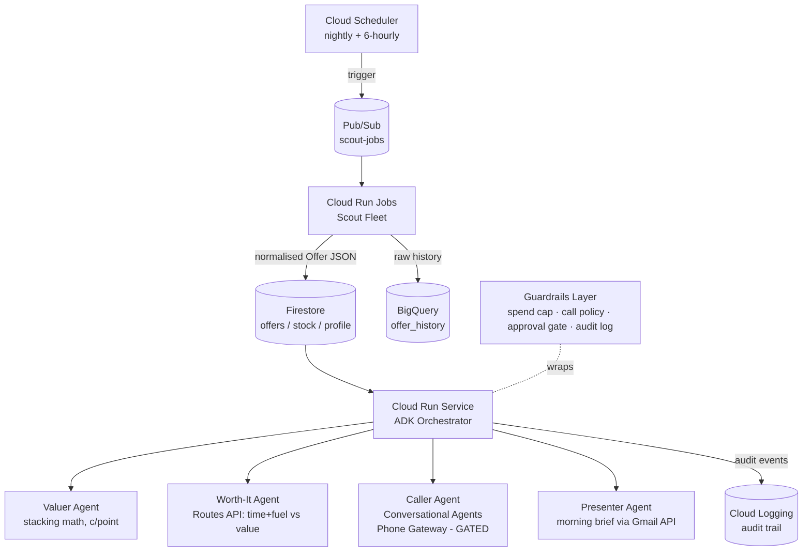

# DuckFleet 🦆✈️

**A background agent fleet that turns rubber ducks into business-class seats.**

In 2025, a $3.50 BigW rubber duck — stacked across promotions — earned Qantas Points at
0.59c/point. The only people who caught it were forum addicts refreshing OzBargain.
DuckFleet is a fleet of agents that hunts the next duck while you sleep: it ingests
offers and stock signals overnight, does the stacking math, computes whether the errand
is worth your time and petrol, phones the store to verify stock (with your approval),
and hands you a ranked action list with your morning coffee.

**Track:** The Taskmaster — background agents that handle the heavy lifting asynchronously.

---

## Architecture (100% GCP)



**Agent fleet (ADK, Python):**

| Agent | Job | Model tier |
|---|---|---|
| `coordinator` | Root orchestrator; sequences the pipeline, owns state | STRONG |
| `scout_pointhacks`, `scout_ozbargain`, `scout_stock` | Parallel ingestion → normalised `Offer` schema | FAST |
| `valuer` | Stack detection, cents-per-point, expected value | STRONG |
| `worth_it` | Drive time + fuel + time-value vs. item value; can REFUSE | FAST |
| `caller` | Voice stock-verification via phone gateway — human-gated | STRONG |
| `presenter` | Ranked morning action list | FAST |

**Governance is a feature, not a slide:** every real-world action (call, purchase
suggestion above cap) passes through `guardrails/gates.py` — spend caps, one-call-per-
store policy, AI self-identification script, human approval gate, structured audit log
to Cloud Logging. The demo shows the agent *refusing* an errand that isn't worth the
drive and *asking permission* before dialling.

---

## Model switching (the bit you asked for)

Every agent takes its model from config, resolved by `agents/model_factory.py`:

- Plain model string (e.g. `gemini-3.5-flash`) → native ADK/Gemini path.
- Prefixed string (e.g. `vertex_ai/claude-sonnet-4-5`) → wrapped in ADK's `LiteLlm`
  adapter, still running through **Vertex AI Model Garden** — so you can A/B Gemini vs
  Claude *without leaving GCP*, per agent tier, via env vars:

```bash
export DUCKFLEET_MODEL_FAST="gemini-3.5-flash"
export DUCKFLEET_MODEL_STRONG="gemini-3.5-pro"
# swap the valuer to Claude on Vertex for an eval run:
export DUCKFLEET_MODEL_STRONG="vertex_ai/claude-sonnet-4-5"
```

For the hackathon submission keep Gemini as the configured default (it's their party);
the switchability itself is a talking point — you can show eval results across models.

---

## Quickstart

```bash
python -m venv .venv && source .venv/bin/activate
pip install -r requirements.txt
cp .env.example .env         # set project, models, home location, caps
adk web                      # local dev UI — run the coordinator interactively
python -m evals.run          # red-team the fleet against failure modes
```

Deploy: see `deploy/README.md` (Cloud Run + Scheduler + Pub/Sub, ~$0 idle).

## Repo map

```
agents/          fleet definitions + tools
schemas/         Offer / StockSignal / ActionItem (Pydantic, the contract)
guardrails/      gates, caps, call policy, audit
evals/           failure-mode harness (duck-hoarding, ToS, rogue-call)
config/          settings via env
deploy/          Cloud Run / Scheduler / Pub/Sub setup
DEMO_SCRIPT.md   3-minute video beat sheet
PLAN.md          2.5-week build cut
```
